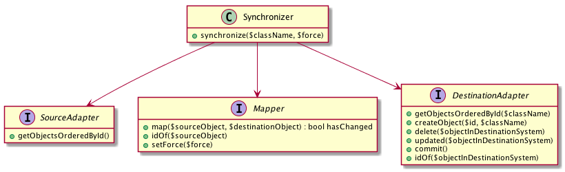

# `content-mapping`

`content-mapping` is a mini framework for mapping content from a source to a destination system. E.g. from Propel objects
to Solr, from Doctrine entities to ElasticSearch or from one XML structure to another. It features interfaces to guide
you on your mapping way and ships with some abstract implementation helpers or magic implementations.

In easy situations, you may want to consider other libraries instead. E.g. if in a Symfony2 project you want to index
Doctrine entities in a Solr server, you may want to consider the great [floriansemm/solr-bundle](/floriansemm/SolrBundle).
But that and other libraries have shortcomings in more complex situation, e.g. when you want to index attributes of
related entities. That's why we present you content-mapping with a more general approach.


## Installation

Add the content-mapping dependency by running the command (see http://getcomposer.org/):

    php composer.phar require webfactory/content-mapping

and run

    php composer.phar install

## Concept



The content-mapping process is based on four parts: the `Synchronizer`, a ``SourceAdapter``, a ``Mapper`` and a
``DestinationAdapter``. The entry point is ``Synchronizer->synchronize()``: there, the Synchronizer gets an Iterator
from the ``SourceAdapter->getObjectsOrderedById()`` as well as an Iterator from the
``DestinationAdapter->getObjectsOrderedById()``, and compares the objects in each one. During the comparison, it deletes
outdated objects (``DestinationAdapter->delete()``), stores a new objects (``DestinationAdapter->createObject()``) and
updates existing objects in the destination system (``Mapper->map()``).
 
``DestinationAdapter->updated()`` and ``DestinationAdapter->commit()`` are only hooks for external change tracking, to
say an object has been updated or both Iterators have been processed, i.e. changes can be persisted.


## Usage

To construct a ``Synchronizer``, you need implementations for the ``SourceAdaper``, ``Mapper`` and
``DestinationAdapter``. Please find abstract templates and ready-to-use generic implementations of SourceAdapters and
DestinationAdapters in the [webfactory/content-mapping-*](https://github.com/search?q=webfactory%2Fcontent-mapping)
packages. The Mapper usually is very specific for your project, so you probably want to implement it in your
application.

```php
use Webfactory\ContentMapping\Synchronizer;
use Webfactory\ContentMapping\SourceAdapter\Propel\GenericPropelSourceAdapter;

$sourceAdapter = ...; // see the readme of the corresponding package on how to construct it
$mapper = ...; // construct your own implementation
$destinationAdapter = ...; // see the readme of the corresponding package on how to construct it
$logger = ...; // just a PSR-3 logger

$classNameToSynchronize = 'MyClass';
$force = false; // if true, objects in destination system will be updated even if no changes are detected

$synchronizer = new Synchronizer($sourceAdapter, $mapper, $destinationAdapter, $logger);
$synchronizer->synchronize($classNameToSynchronize, $force);
```


## Credits, Copyright and License

This project was started at webfactory GmbH, Bonn.

- <https://www.webfactory.de>
- <https://twitter.com/webfactory>

Copyright 2015-2022 webfactory GmbH, Bonn. Code released under [the MIT license](LICENSE).
